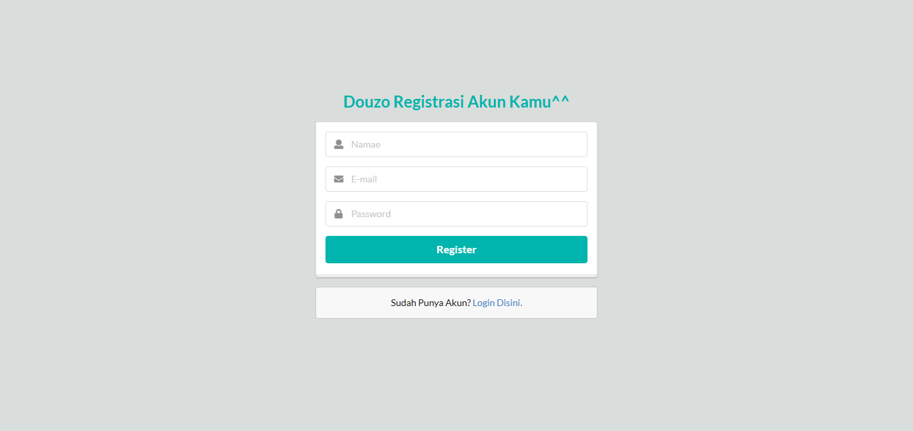
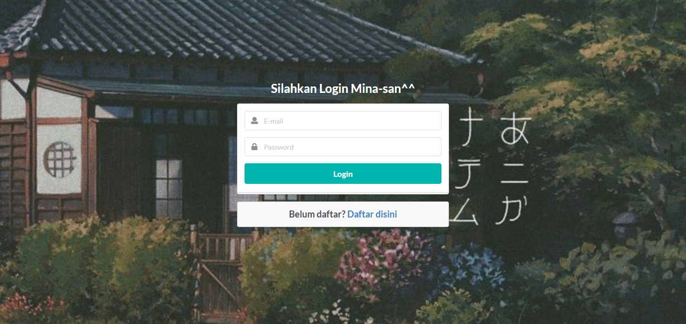
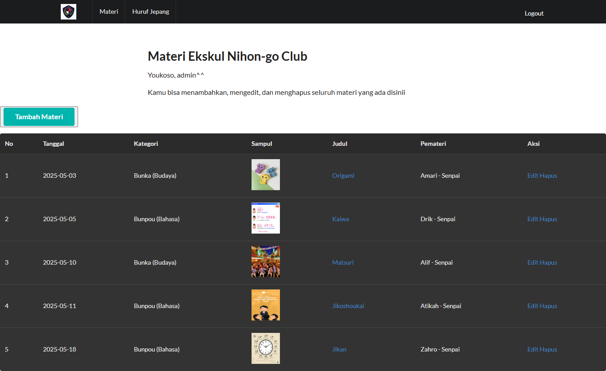
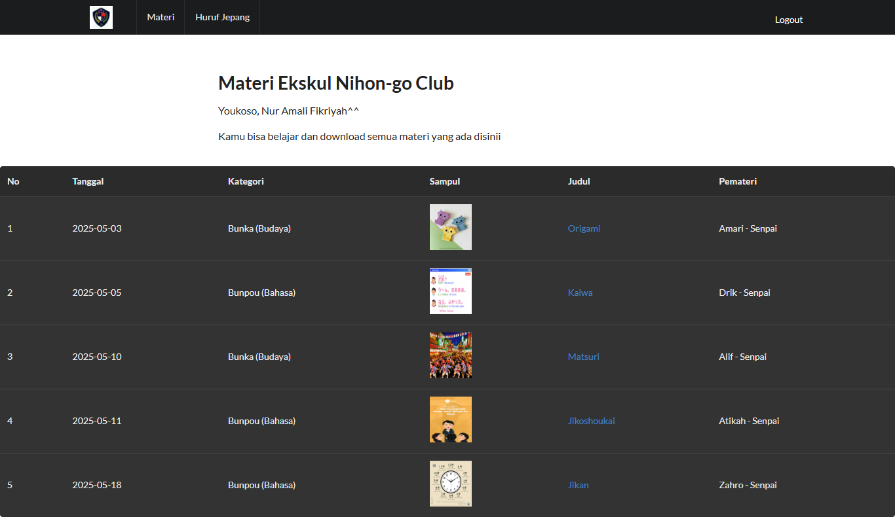
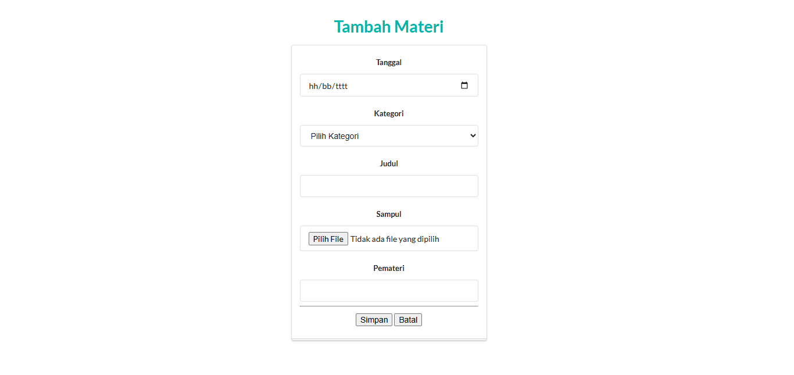
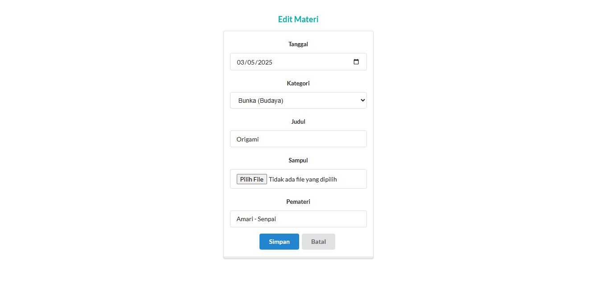
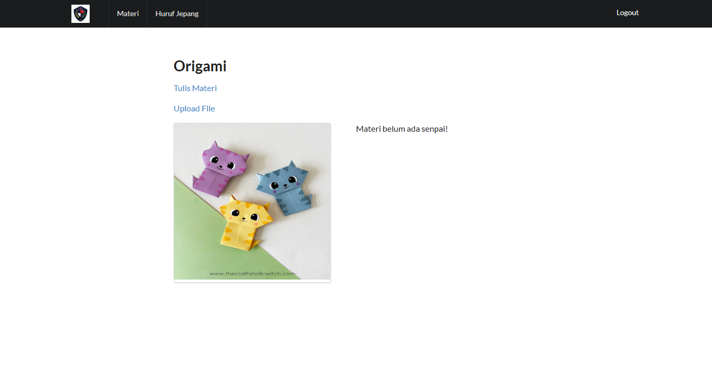
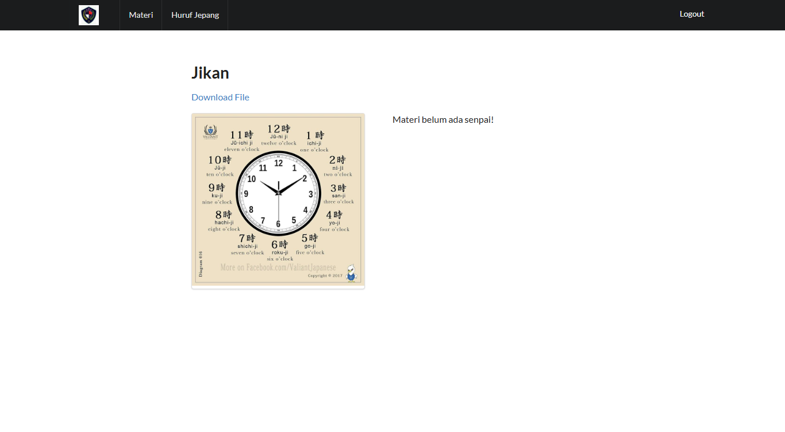
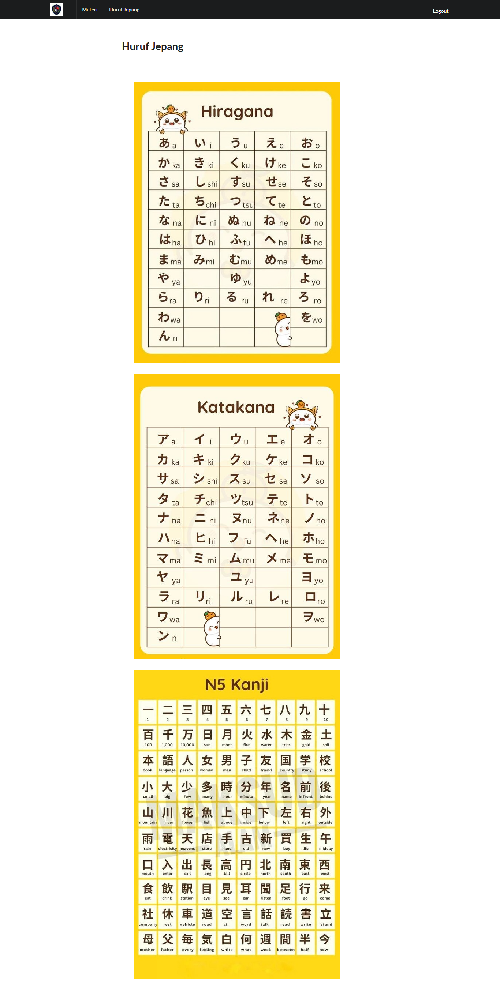

# Aplikasi E-Learning Sederhana dengan Framework CodeIgniter 3

Sebuah aplikasi belajar online sederhana, dibuat sebagai media belajar pada Ekstrakurikuler Nihon-go Club (Bahasa Jepang), agar semuanya bisa mengakses materi dengan mudah dan tidak khawatir tertinggal materi Ekskul.

## Fitur Umum:

- **Authentikasi**

  Terdapat Multi-Level Login:

  - Admin
  - Siswa

- **CRUD**

  - Create
    - Admin dapat menambahkan materi
    - Admin dapat menulis materi
    - Admin dapat upload materi berupa file pdf
  - Read
    - Semua dapat melihat dan mempelajari materi
    - Siswa dapat mendownload materi berupa file pdf
  - Update
    - Admin dapat mengubah materi
  - Delete
    - Admin dapat menghapus materi

## Requirements

- PHP 7 atau 8
- MySQL Database
- Server web Apache (XAMPP)
- CodeIgniter 3

## Instalasi & Konfigurasi

1. Download atau clone repositori ini

```
   git clone https://github.com/nramalifk/elearning.git
```

2. Masuk ke folder project ini
3. Buka file `application/config/config.php`
4. Ubah isi dari variable `$config['base_url']` dengan `http://localhost/elearning/`
5. Buat database dengan nama `elearning` pada phpMyAdmin, import `elearning.sql`
6. Buka `application/config/database.php` dan perbarui pengaturan koneksi database:
   ```php
   $db['default'] = array(
   'hostname' => 'localhost',
   'username' => 'root', // Ubah ini
   'password' => '',
   'database' => 'elearning', // Ubah ini
   'dbdriver' => 'mysqli',
   // Pengaturan lainnya...
   );
   ```
7. Untuk login `admin` kalian bisa menggunakan email = `admin@domain.sch.id` dan password `ngckurabu`

## Screenshot

- Halaman Homepage
  

- Halaman Register
  

- Halaman Login
  

- Halaman List Materi Admin
  

- Halaman List Materi Siswa
  

- Halaman Tambah Materi
  

- Halaman Edit Materi
  

- Halaman View Materi Admin
  

- Halaman Tulis Materi Admin
  

- Halaman View Materi Siswa
  

- Halaman Huruf Jepang
  

_Form pendaftaran dibuat untuk terdaftar sebagai siswa_

_Masih banyak file dan fungsi yang harus diperbaiki, saya akan terus mencoba mengembangkan aplikasi ini lebih baik_

## Author

Nur Amali Fikriyah - [Instagram](https://www.instagram.com/nramalifk_/)
